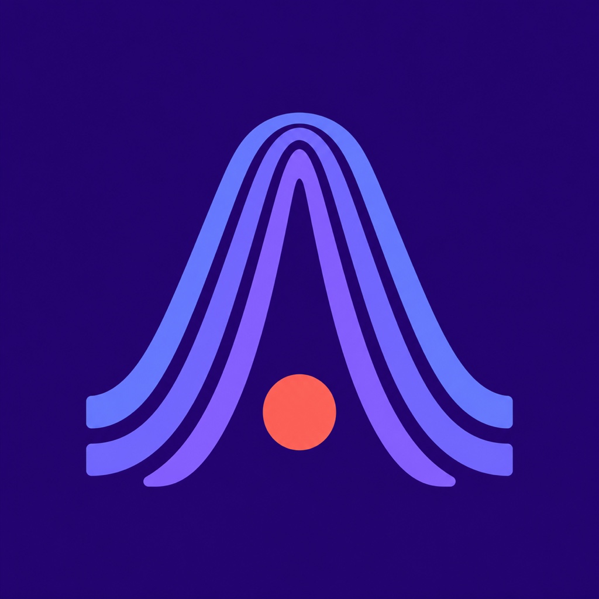
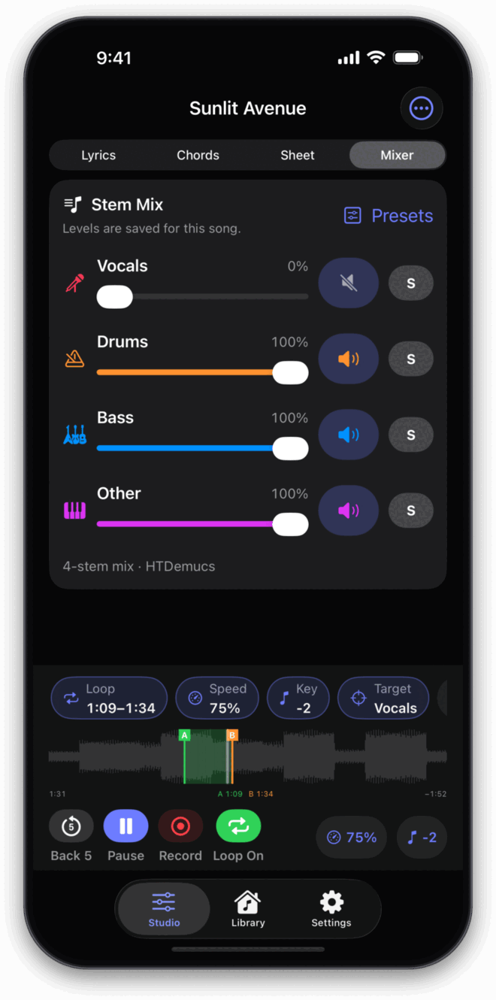
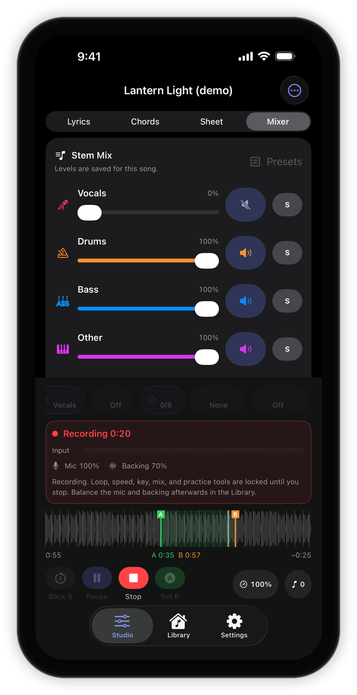
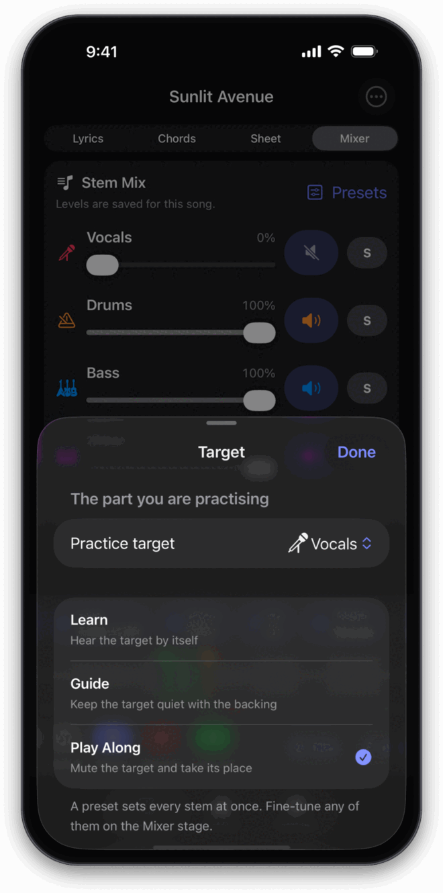
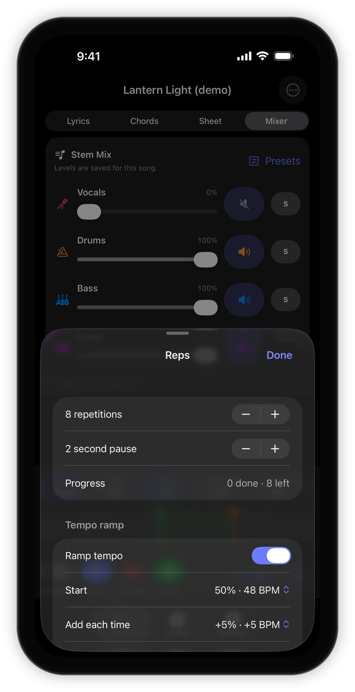
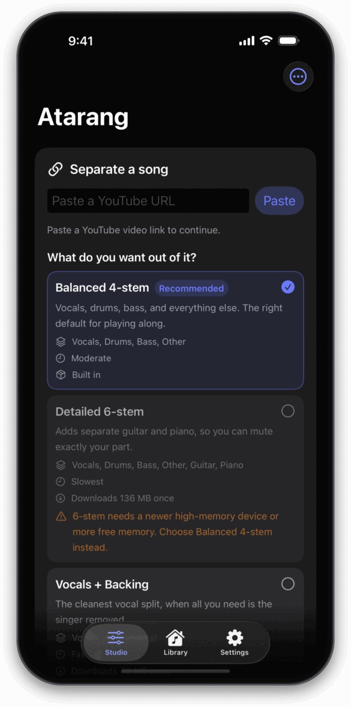
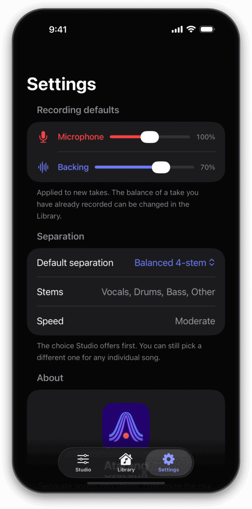
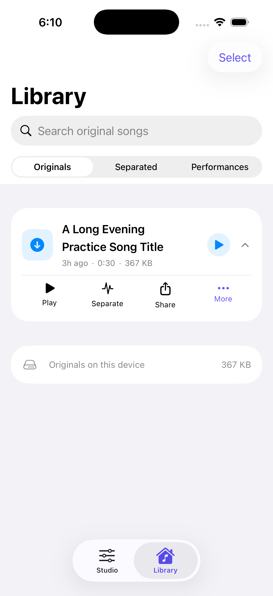
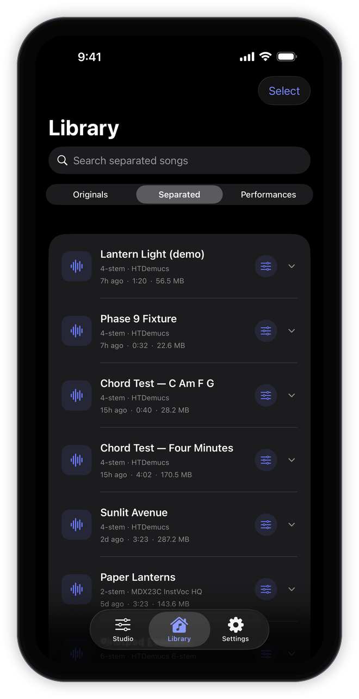
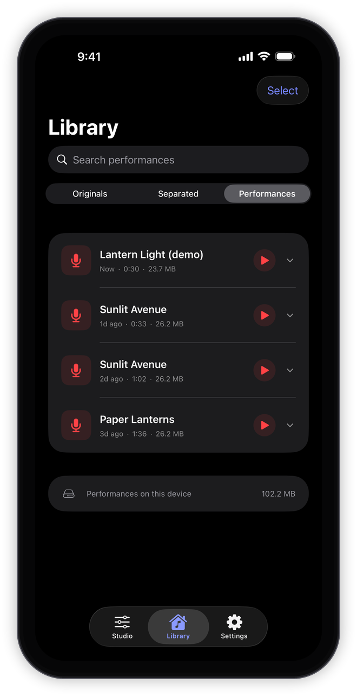

<div align="center">
  
  <h1>Atarang</h1>
  <h3>Your song. Your part.</h3>
  <p>
    Turn a YouTube track into a private, on-device practice studio.<br>
    Separate the music, shape the mix, record your performance, and keep every
    take close at hand.
  </p>
  <p>
    
    
    
    
  </p>
</div>

## Screenshots

| One screen for practice | Recording is a mode |
| :---: | :---: |
|  |  |
| The transport never scrolls: timeline, A–B loop, playback, and the tools that state their current value. | One red strip carries the meter, the levels, and what is locked — instead of a dozen disabled controls. |

| Choose the part you play | Build up repetitions |
| :---: | :---: |
|  |  |
| Hear your part alone, keep it quiet under the band, or mute it and take its place. | Count passes, breathe between them, and ramp from comfortable to full tempo. |

| Separate a song | App-level choices |
| :---: | :---: |
|  |  |
| Pick by outcome, with the stems, speed, download size, and device fit shown before you commit. | Recording defaults, the separation Studio offers first, and the bundled notices. |

| Originals | Separated tracks | Performances |
| :---: | :---: | :---: |
|  |  |  |
| Reuse downloaded audio. | Reopen, play, record, or separate again. | Play, edit, share, or record another take. |

<sub>Captured on iPhone 17 Pro Max in dark mode. The songs are synthetic demo
tracks, so no copyrighted audio appears in the shots.</sub>

## Make any song yours

Atarang is a personal iPhone practice app for musicians and singers. Paste a
YouTube URL, choose how you want the track separated, and let the phone create
synchronized stems locally. Turn down the part you want to perform, press play,
and practise against the rest of the band.

## Practise with purpose

Studio is one screen. A **transport** that never scrolls holds the timeline, the
A–B loop, and the controls you reach for with an instrument in your hands; a
**Stage** shows the song itself; and the practice tools are **chips** that state
their current value and open only themselves. Atarang remembers the stage,
playhead, selected target, mix, loop, speed, pitch, count-in, and saved sections
for each song, so the next session can pick up where the last one ended.

- **Master one phrase** — jump back five seconds, tap A then B on the transport
  to loop it, drag the handles on the timeline to fine-tune, and save multiple
  named sections for quick recall.
- **Slow down or change key** — adjust speed without changing pitch, or
  transpose the backing by semitones without changing tempo.
- **Build up repetitions** — choose a repetition target, add a pause between
  passes, and automatically ramp from a comfortable starting speed to the
  target tempo.
- **Practise your part three ways** — select any available vocal or instrument
  stem, then use **Learn** to hear it alone, **Guide** to keep it quietly in the
  mix, or **Play Along** to mute it and take its place.
- **Add a click and count-in** — let Atarang find the song's tempo and
  downbeats and follow them, or enter a BPM, use tap tempo, choose a
  subdivision, accent the downbeat, set the click level, and align it by hand.
- **Read the chords as you play** — work out the chord chart on the device, in
  bars or as a ribbon under a fixed "now" line, transposed to whatever key you
  have the backing in. Tap a bar to jump to it, hold and drag across bars to
  loop them, and hold one bar to fix a chord Atarang got wrong.
- **Make the chords playable** — reduce the chart to plain triads, open-position
  shapes, or power chords; hide slash chords and passing chords; and let Atarang
  suggest a capo, or a key to shift the whole song into, that turns barre chords
  into open ones. Every simplified chord is marked and the chord Atarang heard is
  a press away.
- **Read a chord sheet** — chord symbols placed over the words they land on,
  exactly where the lyrics carry word timings and estimated across the line where
  they do not, at whatever size reads from an arm's length.
- **Record a predictable loop take** — hear the count-in, record exactly one
  pass from A to B, and quickly compare the latest take with the reference.
- **Sing from synced lyrics** — paste the words or import an `.lrc`, time them
  by tapping once through the song, then tap a line to jump to it, hold one to
  loop it, or drag across several to set A–B. A sing-along mode puts the current
  line on screen at arm's length and keeps the display awake.

## Features

- **Up to six synchronized stems** — isolate vocals, drums, bass, guitar,
  piano, instrumental, or other parts depending on the selected model.
- **A persistent transport** — a waveform timeline with the playhead, the
  shaded A–B loop, draggable boundary handles, and saved-section marks, above
  play, record, back-five, A–B, speed, and key. It is always on screen while a
  song is loaded, and it is the only place that seeks.
- **A hands-on stem mixer** — set a level for every stem, mute or solo parts,
  and apply target-aware Learn, Guide, and Play Along presets.
- **Synced lyrics that do something** — paste plain words, import or export
  `.lrc` (line and word tags, and `[offset:]`), pull in a YouTube caption track,
  or search LRCLIB if you turn that on. Time a song by hand with tap-to-timestamp,
  nudge one line by a tenth of a second or shift them all, and turn `[Chorus]`
  markers into saved sections. The current line is large and centred, auto-scroll
  yields the moment you scroll yourself, and long instrumental stretches count
  you back in.
- **A chord chart worked out on the device** — bars four to a row with the
  current one marked and the next chord counted in beats, or a ribbon that
  scrolls under a fixed "now" line. The key is named, the chart follows the
  transport's transposition, chords Atarang is unsure of are dimmed rather than
  stated, and any chord can be corrected by holding its bar. Corrections survive
  running the analysis again. Nothing is downloaded and nothing leaves the
  device.
- **Chord shapes, a capo, and a sheet** — a chord box for every shape the song
  asks for, open and barre voicings for each, four levels of simplification from
  the full chart down to power chords, a capo search that scores every fret from
  0 to 7 by how much of the song it turns into open shapes, and the same answer
  as a key to shift the audio into. The Sheet stage sets the chords over the
  lyrics they land on. All of it is per song and none of it changes the stored
  chart.
- **A detected beat grid** — tempo, downbeats, and bar lines found from the
  drums, driving the click, the count-in, and A–B loops that snap to bars. A
  wrong tempo is usually one tap to fix, and a grid Atarang is unsure of is
  labelled rather than acted on.
- **Structured song practice** — loop and save difficult sections, control
  speed and key independently, add a count-in and a metronome that can follow
  the song, count repetitions, and ramp up to performance tempo.
- **Performance recording** — capture the microphone and live backing mix
  together, with independent microphone and backing levels; an active loop
  records one predictable pass from A to B.
- **Background-friendly sessions** — playback and recording continue when the
  app is backgrounded or the screen is locked, the lock screen and Control
  Centre show the loaded song, and headphone-remote play, pause, and skip-back
  work. The screen stays awake while a song is actually playing or recording.
- **A personal music library** — browse originals, separations, and
  performances; search, filter, inspect storage use, and reopen any mix.
- **Repeat without redownloading** — reuse a saved separation or run another
  model against an original already on the device.
- **Easy exports** — create an AAC/M4A performance and share performances or
  stems through AirDrop, Files, WhatsApp, and other compatible apps. An export
  keeps running if you open another song, and appears on its Library
  performance when it finishes.
- **Nothing half-saved** — downloads, separations, and takes are written aside
  and only enter the Library once complete and readable, so an interrupted
  operation leaves the previous state rather than a broken entry.
- **Settings that own app-level choices** — default microphone and backing
  levels for new takes, a remembered default separation, the app's version and
  source, and the bundled third-party notices.
- **Private by design** — extraction, separation, mixing, playback, and
  recording happen on the iPhone. There is no Atarang backend or account.

> [!TIP]
> Use headphones while recording for the cleanest take and to keep the backing
> track out of the microphone.

## How it works

1. **Paste** a `youtube.com` or `youtu.be` link.
2. **Choose** what you want out of it — Balanced 4-stem, Detailed 6-stem, or
   Vocals + Backing.
3. **Mix** the generated parts to make room for your voice or instrument.
4. **Play, record, and share** — your tracks and takes remain available in the
   on-device Library.

## Separation models

The app names these by outcome; the architecture behind each is secondary
detail.

| In the app | Model | Output | Availability | Best for |
| --- | --- | --- | --- | --- |
| **Balanced 4-stem** | HTDemucs | Vocals, drums, bass, other | Bundled | A balanced default with four-part control |
| **Detailed 6-stem** | HTDemucs 6-stem | Vocals, drums, bass, other, guitar, piano | 136 MB first-use download | Detailed instrument control on newer, high-memory devices |
| **Vocals + Backing** | MDX23C InstVoc HQ | Vocals, instrumental | 40 MB first-use download | A high-quality general vocal split |
| **Vocals + Backing, vocal-focused** | Kim Vocals | Vocals, instrumental | 67 MB first-use download | An alternative, vocal-focused separation |

Optional models are downloaded only when selected, verified against pinned
SHA-256 checksums, stored in Application Support, and excluded from iCloud
backup. An install is published atomically and recorded in a manifest, so a
download interrupted part way is re-fetched rather than reported as installed.
After a model has been downloaded, its separation work remains on-device.

## Install on your iPhone

Atarang is currently a personal, sideloaded project rather than an App Store
release.

### Requirements

- A Mac with Xcode and an iOS 17 SDK
- [Git LFS](https://git-lfs.com/) for the bundled HTDemucs model weights
- An iPhone or iPad running iOS 17 or later
- An Apple Developer account for device signing
- A recent iPhone recommended for faster separation and the 6-stem model

### Clone with the model weights

The bundled HTDemucs model stores its 190 MB weight blob in Git LFS. Install
and enable Git LFS **before cloning**:

```sh
brew install git-lfs
git lfs install
git clone <repository-url>
cd Atarang
```

`git lfs install` is a one-time setup for your user account. After that, normal
Git clones automatically download LFS files. Git itself cannot install Git LFS,
so each developer must complete this setup once.

If you cloned Atarang before installing Git LFS, fetch the model weights
manually from the repository root:

```sh
git lfs install
git lfs pull
```

Verify that the model blob was downloaded before building:

```sh
wc -c < Atarang/HTDemucs_CoreML_FP16.mlpackage/Data/com.apple.CoreML/weights/weight.bin
```

The command should print `190099328`. A 134-byte file beginning with
`version https://git-lfs.github.com/spec/v1` is only an unresolved LFS pointer.
Building with that pointer causes Core ML to fail with “Failed to build the
model execution plan … error code: -5.” After fetching the real weights, clean
the Xcode build folder and rebuild the app.

### Build and run

1. Open `Atarang.xcodeproj` in Xcode and let Swift Package Manager resolve the
   dependencies.
2. Select the **Atarang** target and open **Signing & Capabilities**.
3. Choose your Apple Developer team. If needed, replace the existing bundle
   identifier with one that belongs to your account.
4. Connect and unlock your iPhone, trust the Mac if prompted, and select the
   device as the run destination.
5. Press **Run**, then paste a YouTube URL and tap **Create stems**.

Keep Atarang open while separation is running. The bundled default FP16 model
is approximately 233 MB before Xcode compilation, and the work is compute
intensive.

## Privacy and network use

Atarang has no backend or companion service. Network access is used only to
fetch YouTube metadata and audio and, on first use, the selected optional
model. A pinned `yt-dlp` Python zipapp is bundled with the project; the current
checked-in version is `2026.07.04` and its SHA-256 checksum is verified before
use.

Lyrics are the one place the app can talk to a service that is not YouTube, and
it is opt-in. **Online lyrics lookup is off by default.** With it turned on in
Settings, searching sends the song title — and the artist name, if you type one
— to [lrclib.net](https://lrclib.net), and nothing else. Nothing is sent while
it is off. Pasting lyrics, importing an `.lrc` file, and timing lines by tapping
all work with no network at all. Fetching a video's caption track uses the same
bundled `yt-dlp` and the same YouTube connection as the audio download.

The Library is stored locally on the device. It can permanently delete
originals, separations, and performances.

> [!IMPORTANT]
> Only download audio you have permission to use and follow YouTube's terms.
> This personal sideloaded build is not designed or suitable for App Store
> distribution.

## Third-party software

- Hybrid Transformer Demucs and its pretrained weights, © Meta Platforms,
  Inc., MIT License.
- HTDemucs Core ML conversion, © 2026 Dejan Nikolic, MIT License.
- ONNX Runtime, © Microsoft Corporation, MIT License.
- ZIPFoundation, © 2017–2025 Thomas Zoechling, MIT License.
- Optional model conversions and weights are attributed in the third-party
  notices.
- YoutubeDL-iOS, © 2020 Changbeom Ahn, MIT License.

See [`THIRD_PARTY_LICENSES.md`](THIRD_PARTY_LICENSES.md) for complete notices.
The same file ships in the app and is readable under **Settings › About ›
Third-Party Notices**.
