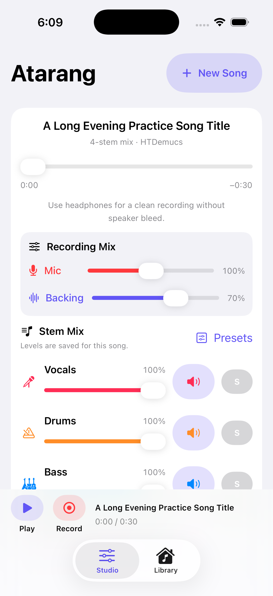

  
  <h1>Atarang</h1>
  <h3>Your song. Your part.</h3>
  

    Turn a YouTube track into a private, on-device practice studio. 
    Separate the music, shape the mix, record your performance, and keep every
    take close at hand.
  

  

    
    
    
    
  

## Screenshots

| Start a session | Mix and record |
| :---: | :---: |
|  |  |
| Paste a link and choose a separation style. | Shape every stem and balance the microphone and backing track. |

| Originals | Separated tracks | Performances |
| :---: | :---: | :---: |
|  |  |  |
| Reuse downloaded audio. | Reopen, play, record, or separate again. | Play, edit, share, or record another take. |

## Make any song yours

Atarang is a personal iPhone practice app for musicians and singers. Paste a
YouTube URL, choose how you want the track separated, and let the phone create
synchronized stems locally. Turn down the part you want to perform, press play,
and practise against the rest of the band.

## Features

- **Up to six synchronized stems** — isolate vocals, drums, bass, guitar,
  piano, instrumental, or other parts depending on the selected model.
- **A hands-on stem mixer** — set a level for every stem, mute or solo parts,
  and jump between Full Mix, Without Vocals, and Vocals Only presets.
- **Structured song practice** — save A–B sections, transpose by semitones,
  add a manually aligned metronome, count repetitions, and ramp from a slower
  starting speed to performance tempo.
- **Performance recording** — capture the microphone and live backing mix
  together, with independent microphone and backing levels; an active loop
  records one predictable pass from A to B.
- **Background-friendly sessions** — playback and recording continue when the
  app is backgrounded or the screen is locked.
- **A personal music library** — browse originals, separations, and
  performances; search, filter, inspect storage use, and reopen any mix.
- **Repeat without redownloading** — reuse a saved separation or run another
  model against an original already on the device.
- **Easy exports** — create an AAC/M4A performance and share performances or
  stems through AirDrop, Files, WhatsApp, and other compatible apps.
- **Private by design** — extraction, separation, mixing, playback, and
  recording happen on the iPhone. There is no Atarang backend or account.

> [!TIP]
> Use headphones while recording for the cleanest take and to keep the backing
> track out of the microphone.

## How it works

1. **Paste** a `youtube.com` or `youtu.be` link.
2. **Choose** a 2-, 4-, or 6-stem separation style.
3. **Mix** the generated parts to make room for your voice or instrument.
4. **Play, record, and share** — your tracks and takes remain available in the
   on-device Library.

## Separation models

| Model | Output | Availability | Best for |
| --- | --- | --- | --- |
| **HTDemucs** | Vocals, drums, bass, other | Bundled | A balanced default with four-part control |
| **HTDemucs 6-stem** | Vocals, drums, bass, other, guitar, piano | 136 MB first-use download | Detailed instrument control on newer, high-memory devices |
| **MDX23C InstVoc HQ** | Vocals, instrumental | 40 MB first-use download | A high-quality general vocal split |
| **Kim Vocals** | Vocals, instrumental | 67 MB first-use download | An alternative, vocal-focused separation |

Optional models are downloaded only when selected, verified against pinned
SHA-256 checksums, stored in Application Support, and excluded from iCloud
backup. After a model has been downloaded, its separation work remains
on-device.

## Install on your iPhone

Atarang is currently a personal, sideloaded project rather than an App Store
release.

### Requirements

- A Mac with Xcode and an iOS 17 SDK
- An iPhone or iPad running iOS 17 or later
- An Apple Developer account for device signing
- A recent iPhone recommended for faster separation and the 6-stem model

### Build and run

1. Open `Atarang.xcodeproj` in Xcode and let Swift Package Manager resolve the
   dependencies.
2. Select the **Atarang** target and open **Signing & Capabilities**.
3. Choose your Apple Developer team. If needed, replace the existing bundle
   identifier with one that belongs to your account.
4. Connect and unlock your iPhone, trust the Mac if prompted, and select the
   device as the run destination.
5. Press **Run**, then paste a YouTube URL and tap **Create stems**.

Keep Atarang open while separation is running. The bundled default FP16 model
is approximately 233 MB before Xcode compilation, and the work is compute
intensive.

## Privacy and network use

Atarang has no backend or companion service. Network access is used only to
fetch YouTube metadata and audio and, on first use, the selected optional
model. A pinned `yt-dlp` Python zipapp is bundled with the project; the current
checked-in version is `2026.07.04` and its SHA-256 checksum is verified before
use.

The Library is stored locally on the device. It can permanently delete
originals, separations, and performances, and it automatically discovers media
created by older builds when the files are still present.

> [!IMPORTANT]
> Only download audio you have permission to use and follow YouTube's terms.
> This personal sideloaded build is not designed or suitable for App Store
> distribution.

## Third-party software

- Hybrid Transformer Demucs and its pretrained weights, © Meta Platforms,
  Inc., MIT License.
- HTDemucs Core ML conversion, © 2026 Dejan Nikolic, MIT License.
- ONNX Runtime, © Microsoft Corporation, MIT License.
- ZIPFoundation, © 2017–2025 Thomas Zoechling, MIT License.
- Optional model conversions and weights are attributed in the third-party
  notices.
- YoutubeDL-iOS, © 2020 Changbeom Ahn, MIT License.

See [`THIRD_PARTY_LICENSES.md`](THIRD_PARTY_LICENSES.md) for complete notices.
